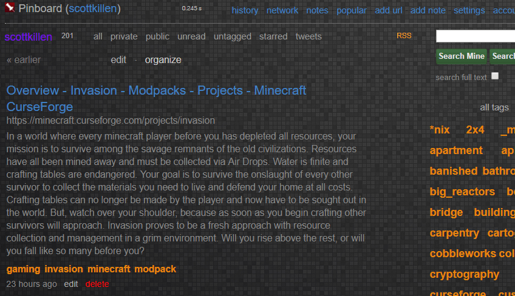

This repository hosts a collection of user-created themes and styles designed to enhance the browsing experience on specific websites. These themes and styles allow users to customize the appearance of websites, improving readability and visual appeal according to individual preferences.

## Installation

To use these themes and styles, you'll typically need a browser extension that allows you to apply custom CSS to websites. Popular choices include:

*   **Stylus:** Available for [Firefox](https://addons.mozilla.org/en-US/firefox/addon/styl-us/), [Chrome](https://chrome.google.com/webstore/detail/stylus/clngdbkpkpeebahjckkjfobafhncgmne), and [Opera](https://addons.opera.com/en/extensions/details/stylus/).
*   **Tampermonkey:** Available for [Firefox](https://addons.mozilla.org/en-US/firefox/addon/tampermonkey/), [Chrome](https://chrome.google.com/webstore/detail/tampermonkey/dhdgffkkebhmkfjojejmpbldmpobfkfo), [Edge](https://microsoftedge.microsoft.com/addons/detail/tampermonkey/iikmkjmpaadaobahmlepeloendndfphd), [Safari](https://www.tampermonkey.net/index.php?ext=dhdg&browser=safari), and [Opera](https://addons.opera.com/en/extensions/details/tampermonkey-beta/).

**General Steps to Install a Style:**

1.  **Install the Extension:** Add your chosen extension (e.g., Stylus) to your browser.
2.  **Find a Style:** Each theme/style in this repository will either have a direct link to a userstyles.world page or its CSS code directly in a `.css` file.
3.  **Install via Userstyles.world:**
    *   If a `userstyles.world` link is provided, click it.
    *   On the style's page, look for an "Install Style" button (or similar wording) provided by your browser extension. Click it to install.
4.  **Install via CSS Code:**
    *   If the style is provided as a `.css` file, open the file and copy its content.
    *   Open your browser extension's management dashboard (usually accessible from the browser's toolbar).
    *   Look for an option like "Write new style" or "Add new script".
    *   Paste the copied CSS code into the editor.
    *   Specify which website(s) the style should apply to. This information is usually found in the style's description within this repository.
    *   Save the new style.

Please refer to the specific documentation of your chosen browser extension for more detailed instructions.

# Dark Themes

### Pinboard Dark

- **Published:** [userstyles.world](https://userstyles.world/style/1340/pinboard-dark)
- **For:**  [Pinboard](https://pinboard.in)

# Readability Styles

### Larger Font for elysahenegar.com

Increases the font size on elysahenegar.com for improved readability.

- **Published:** [userstyles.world](https://userstyles.world/style/1342/elysahenegar-larger-font)
- **For:**  [Breathing](https://elysahenegar.com/)

### Nexus Mods Wiki TOC Whitespace Fix

Adjusts whitespace for large tables of contents on Nexus Mods Wiki pages for better layout and readability.

- **Published:** [userstyles.world](https://userstyles.world/style/1341/nexus-mods-wiki-whitespace)
- **For:**  [Nexus Mods Wiki](https://wiki.nexusmods.com/index.php/Main_Page)

---

## Contributing

Contributions are welcome! If you have a style or theme to add, or an improvement to an existing one, please follow these steps:

1.  **Fork the repository:** Click the 'Fork' button at the top right of this page.
2.  **Create a new branch:** For your changes, create a new branch in your forked repository (e.g., `git checkout -b my-new-theme`).
3.  **Make your changes:** Add your new theme/style or modify existing files.
    *   If adding a new style, try to follow the existing format in this README for documenting it.
    *   Include a clear description and, if possible, a link to where it's published (e.g., userstyles.world) and a preview image.
4.  **Commit your changes:** Commit your work with a clear commit message.
5.  **Submit a pull request:** Push your branch to your fork and then open a pull request against the main branch of this repository.

Please ensure your contributions are your own work or are appropriately licensed.

---

